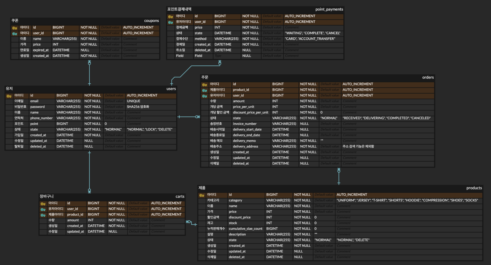
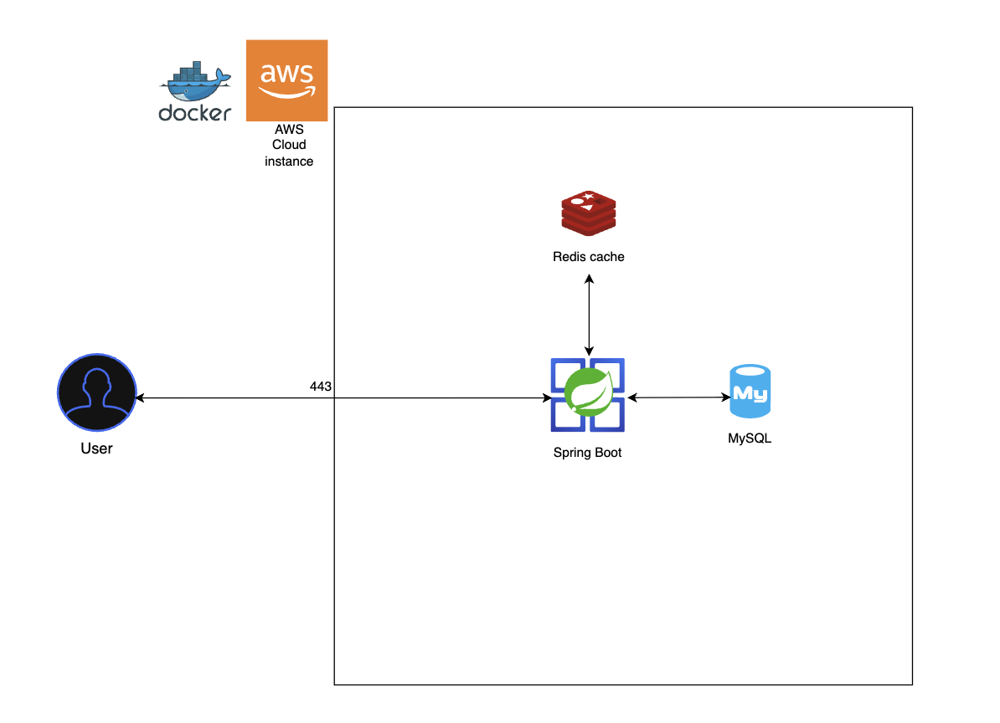

## 프로젝트

## ERD


## 인프라구성도

> 원본 파일은 [infrastructure.drawio](./docs/infrastructure/infrastructure.drawio) 에서 편집 가능합니다.

## Getting Started

### Prerequisites

#### Running Docker Containers

`local` profile 로 실행하기 위하여 인프라가 설정되어 있는 Docker 컨테이너를 실행해주셔야 합니다.

```bash
docker-compose up -d
```
